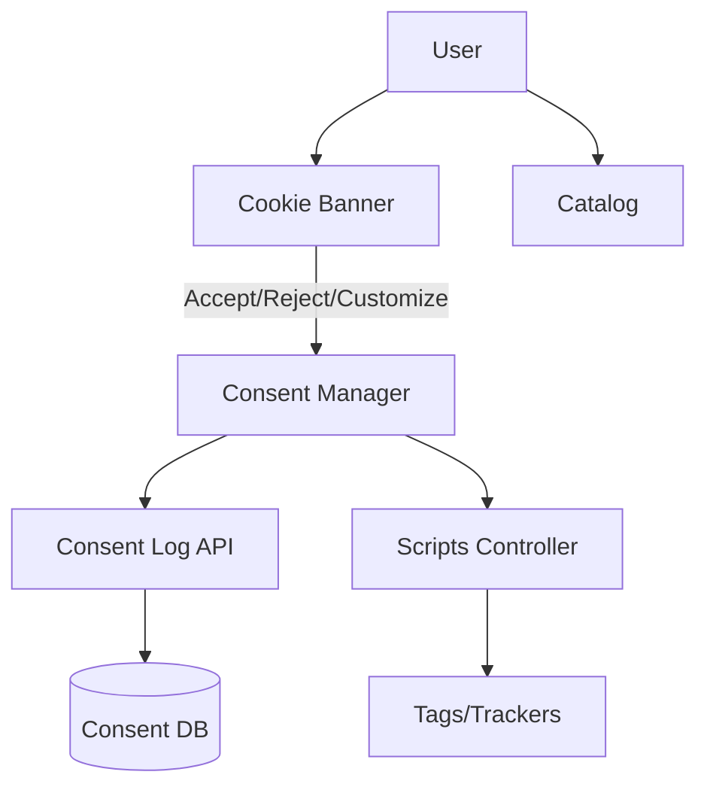

/**
 * @file: docs/project.md
 * @description: Общее описание архитектуры и компонентов проекта.
 * @dependencies: memory-bank/*, docs/changelog.md, docs/tasktracker.md
 * @created: 2025-08-18
 */

# Архитектура проекта

## Компоненты
- Consent UI: баннер/модалка, экран настроек, страница отзыва согласия.
- Policies: страницы Политики конфиденциальности и Cookie, версия и локализация.
- Consent Log API: сервис для записи/чтения согласий (версия политики, юрисдикция, таймштамп, статус).
- Scripts Controller: управляет загрузкой скриптов по категориям согласия (необходимые/аналитика/маркетинг/функциональные).
- Catalog: категории (часы, украшения), карточки товаров, фильтры.

## Диаграмма

## Примечания
- Юрисдикции (ЕС/РФ/CH) влияют на тексты и поведение Consent UI.
- Предусмотреть Google Consent Mode v2 при использовании GA/Ads.
- Логи согласий хранить с версионированием политик.

## Навигация и категории (2025-09-04)
- Добавлена категория каталога: «Часы» (`id: watches`).
- В верхнем меню (desktop) добавлен пункт «Часы» рядом с «Ювелирные изделия» и «О нас».
- В мобильном меню в разделе «Категории» добавлен пункт «Часы».

## UX переходы и прокрутка (2025-09-04)
- Глобальная плавная прокрутка через CSS: `html { scroll-behavior: smooth; }` в `src/index.css`.
- Плавные переходы между маршрутами:
  - Класс `.route-fade` и `@keyframes route-fade-in` в `src/index.css`.
  - В `src/App.jsx` `<Outlet />` обёрнут в контейнер с `key={location.pathname}` и классом `.route-fade`.
- Автопрокрутка к началу на смену маршрута: `useEffect` с `window.scrollTo({ top: 0, behavior: 'smooth' })`.
